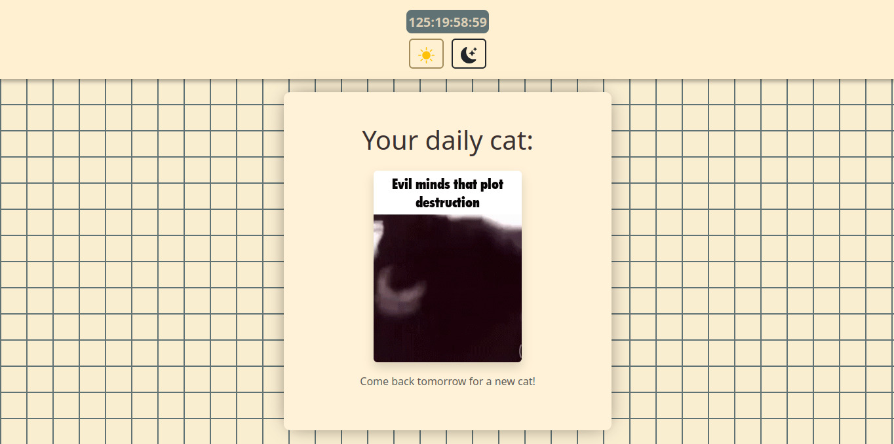

# 🐱 Daily Cats

A simple full-stack web application that displays a new cat GIF every day.  
Built with Node.js, Express, CORS, and a custom frontend to bring joy to cat lovers—one GIF at a time.

---

## 🌐 Features

- 🐾 Daily-changing cat GIFs
- 🔁 Backend API with Express
- 🎨 Custom frontend interface
- 🌍 CORS-enabled for secure cross-origin requests

---

## Tech Stack

### Backend

<center>


</center>

### Frontend

- Simple responsive UI (HTML, CSS, JS, BOOSTRAP)
- Fetches and displays a different cat GIF each day

---

## 📁 Project Structure

```sh
/daily-cats
├── frontend/
│   ├── css/
│   │   └── style.css
│   ├── js/
│   │   └── api-cats.js
│   └── index.html
├── node_modules/
├── public/
│   ├── [cat-gifs].gif
│   └── preview.png
├── .gitignore
├── app.js
├── package-lock.json
├── package.json
├── README.md
└── utils.js
```

## 🛠️ Getting Started

### Clone repo

```sh
git clone https://github.com/your-username/daily-cats.git
cd daily-cats
```

### Install dependencies

```sh
npm install
```

### Run server

```sh
npm start
```

### Open fronted

Just open frontend/index.html in your browser

## Future Improvents

- dark mode toggle

- cache gif for offline viewing

- functional realtime clock

- add more cat gifs

## Preview


